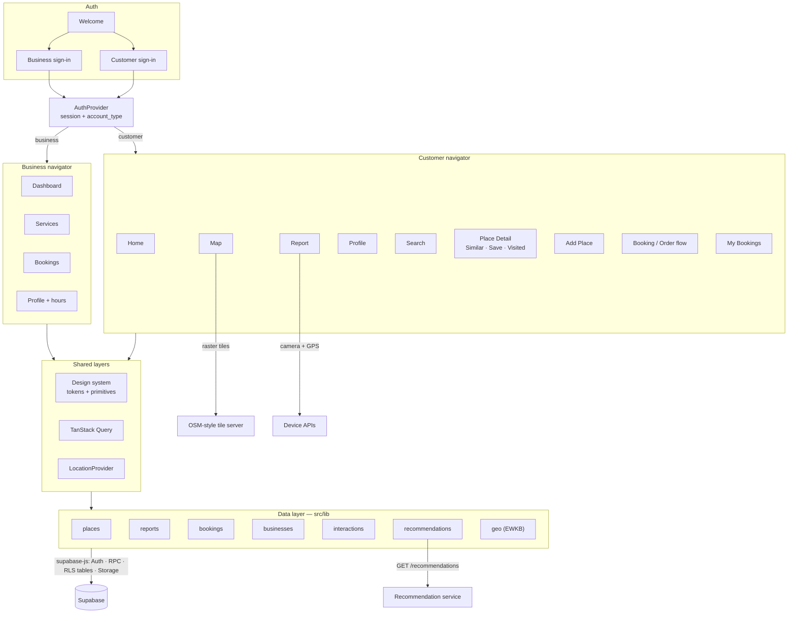
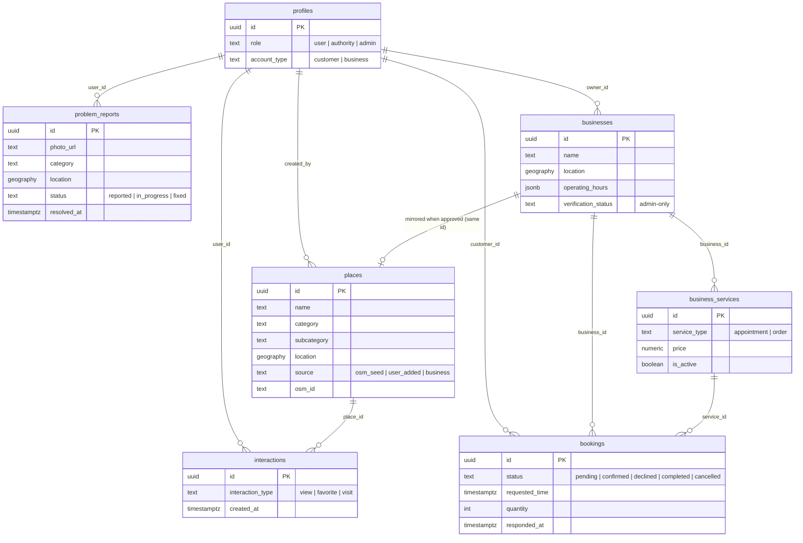
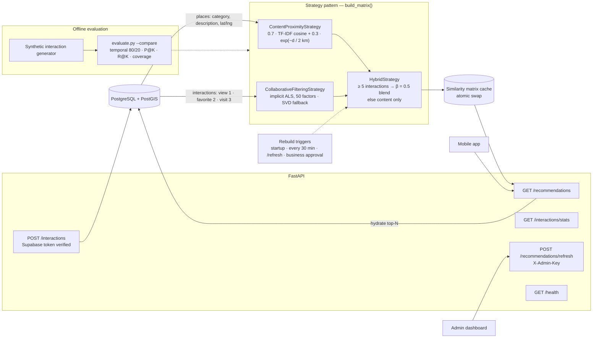
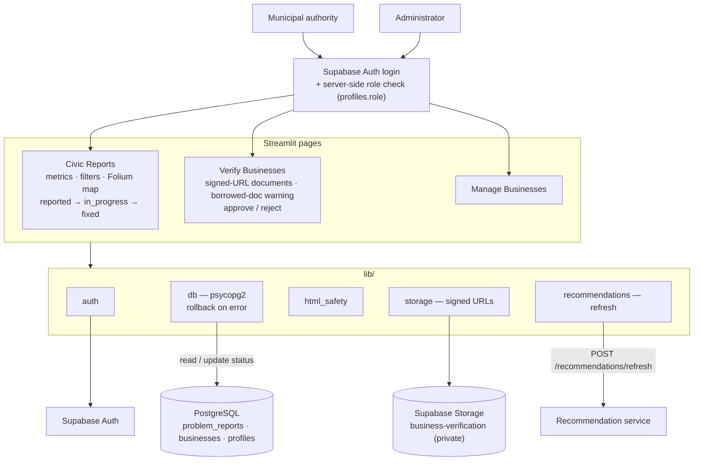

# CityGuide — Capstone Progress Presentation

> Slide material for the guide review: the four modules, how far each one has got, the
> architecture of each module and of the whole system, the tech stack, where we stand against the
> plan, and what's left.
>
> Based on the repository as of **2026-10-07** (commit `2025dd8`, phases 1–4 committed).
> Sources: the code itself, `PROJECT_SCOPE.md`, `PROJECT_STATUS.md`, `docs/PROPOSED_METHODOLOGY.md`,
> `docs/EVALUATION.md`, `docs/DEPLOYMENT.md`.

---

## Contents

1. [Project at a glance](#1-project-at-a-glance)
2. [The four modules and overall progress](#2-the-four-modules-and-overall-progress)
3. [Complete system architecture](#3-complete-system-architecture)
4. [Module 1 — Mobile application](#4-module-1--mobile-application-mobile)
5. [Module 2 — Backend and database](#5-module-2--backend-and-database-supabase)
6. [Module 3 — Recommendation service](#6-module-3--recommendation-service-recommendation-service)
7. [Module 4 — Admin dashboard](#7-module-4--admin-dashboard-admin-dashboard)
8. [Full plan vs current implementation](#8-full-plan-vs-current-implementation)
9. [What's left to do](#9-whats-left-to-do)
10. [Out of scope and future work](#10-out-of-scope-and-future-work)
11. [Architecture-diagram prompts](#11-architecture-diagram-prompts)
12. [Suggested slide order](#12-suggested-slide-order)

---

## 1. Project at a glance

**CityGuide** is a community-curated city guide app with three jobs:

| Pillar | What the user gets |
| :-- | :-- |
| **Discovery** | Find shops, parks, temples, hospitals etc. on a map; search them; see **"similar places"** for any place; add a place that's missing |
| **Civic reporting** | Photograph a civic problem (pothole, garbage, broken street light, water leakage, damaged road). GPS is captured automatically, and municipal authorities triage it on a web dashboard |
| **Local business** | Businesses register, are verified by an admin, list services, and accept **appointment bookings and orders** from customers |

**Hard constraint:** no paid third-party APIs. Maps use OpenStreetMap-style tiles, place data
comes from the OSM Overpass API, and every service runs on a free tier.

**Key numbers**

| | |
| :-- | :-- |
| Modules | 4 (mobile, backend/DB, recommendation service, admin dashboard) |
| Source code | ~14,000 lines (mobile ~9,250 · backend SQL ~1,850 · recommender ~2,275 · dashboard ~780) |
| Database migrations | 11 versioned SQL migrations (`001` → `011`) |
| Automated checks | 55 SQL security assertions · 66 recommender tests (92% coverage) · 15 dashboard tests · 64 mobile tests (98% coverage of `src/lib`) |
| Mobile screens | 20 (customer, business owner and auth flows) |

---

## 2. The four modules and overall progress

### Summary

| # | Module | Directory | Code complete | **Overall completion** |
| :-: | :-- | :-- | :-: | :-: |
| 1 | Mobile application | `/mobile` | ~100% of planned features | **≈ 80%** |
| 2 | Backend & database | `/supabase` | 100% (all 11 migrations) | **≈ 91%** |
| 3 | Recommendation service | `/recommendation-service` | ~97% (tuning decision open) | **≈ 86%** |
| 4 | Admin dashboard | `/admin-dashboard` | ~95% | **≈ 82%** |
| | **Whole system** | | **≈ 98%** | **≈ 85%** |

```
Mobile app              ████████████████░░░░  80%
Backend & database      ██████████████████░░  91%
Recommendation service  █████████████████░░░  86%
Admin dashboard         ████████████████░░░░  82%
─────────────────────────────────────────────────
Overall                 █████████████████░░░  85%
```

### How the percentages are calculated

"Code complete" alone would put every module near 100%, which overstates where the project is.
Each module is scored against five stages of delivery instead, with fixed weights:

| Stage | Weight | Counts as done when… |
| :-- | :-: | :-- |
| Design & planning | 10% | Module scope, interfaces and data model are documented |
| Implementation | 55% | Every feature in the plan exists in code |
| Automated testing | 15% | Unit/integration tests exist and pass, with good coverage |
| Real-environment verification | 10% | It's been run against the real Supabase project / a real phone, not only local stand-ins |
| Deployment | 10% | It's running somewhere the guide or a user can reach |

| Stage (weight) | Mobile | Backend | Recommender | Dashboard |
| :-- | :-: | :-: | :-: | :-: |
| Design & planning (10) | 10 | 10 | 10 | 10 |
| Implementation (55) | 55 | 55 | 53 | 52 |
| Automated testing (15) | 10 | 15 | 15 | 10 |
| Real-environment verification (10) | 2 | 5 | 5 | 7 |
| Deployment (10) | 3 | 6 | 3 | 3 |
| **Total** | **80** | **91** | **86** | **82** |

*The whole-system figure is the plain average of the four modules.*

Why the scores differ:
- **Mobile** loses the most on verification. Every screen typechecks and the Android bundle builds,
  but nobody has tapped through the app on a phone yet, and only the data layer has tests (no
  screen/E2E tests).
- **Backend** scores highest: all migrations are written and checked by 55 self-testing SQL
  assertions. Migrations `009`–`011` still have to be applied to the live Supabase project.
- **Recommender** is fully implemented and well tested. It isn't deployed to Render yet, it hasn't
  been evaluated on the real place catalogue, and a hyperparameter decision is still open.
- **Dashboard**: all pages work and were exercised end-to-end locally (including approving a
  business), but only `lib/` is unit-tested and it isn't deployed yet.

---

## 3. Complete system architecture

### Architecture style

A **four-tier layered architecture** in a monorepo. All tiers share **one PostgreSQL database
as the single source of truth**, so there's no sync layer between components.

| Tier | Module | Talks to the database via |
| :-- | :-- | :-- |
| Presentation | Mobile app (React Native / Expo) | `supabase-js` → PostgREST RPCs + RLS-protected tables |
| Intelligence | Recommendation service (FastAPI) | SQLAlchemy + psycopg2 (service connection) |
| Administration | Admin dashboard (Streamlit) | psycopg2 (direct connection) |
| Data | Supabase (PostgreSQL + PostGIS, Auth, Storage) | — |

### Diagram

```
                ┌───────────────────────────────────────────────────────────┐
                │      PRESENTATION — React Native / Expo mobile app        │
                │  Auth · Home · Map · Search · Place detail · Add place ·  │
                │  Report (camera+GPS) · Bookings/Orders · Business owner   │
                └───────┬──────────────────────┬────────────────────┬───────┘
     GET /recommendations│     supabase-js: RPCs, │ RLS tables,        │ photo upload
                        ▼     auth (JWT)         ▼                    ▼
 ┌──────────────────────────────┐   ┌──────────────────────────────────────────────┐
 │ INTELLIGENCE — FastAPI        │   │ BACKEND SERVICES — Supabase                   │
 │ Content (TF-IDF + Haversine)  │   │ Auth (JWT) · Row Level Security + column      │
 │ Collaborative (implicit ALS)  │   │ grants · Storage (reports, verification) ·    │
 │ Hybrid + cold-start fallback  │   │ RPCs (nearby_places, search_places) · triggers│
 │ In-memory similarity cache    │   └──────────────────────┬───────────────────────┘
 └──────────────┬────────────────┘                          │
                │ SQLAlchemy                                ▼
                │            ┌───────────────────────────────────────────────────────┐
                └──────────► │ DATA — PostgreSQL + PostGIS                            │
                             │ profiles · places · interactions · problem_reports ·   │
 ┌────────────────────────┐  │ businesses · business_services · bookings              │
 │ ADMINISTRATION —        │  └───────────────────────────────────────────────────────┘
 │ Streamlit dashboard     │ psycopg2 ▲                           ▲
 │ Report triage · Folium  ├──────────┘                           │ seed_places.py
 │ map · Business verify   │ ── refresh on approval ──► FastAPI    │
 └────────────────────────┘                       OSM Overpass API ┘
```

### End-to-end data flows (one line each — good for a "how it works" slide)

1. **Browse:** App → `nearby_places` / `search_places` RPC → PostGIS distance query → flat rows with lat/lng.
2. **Similar places:** App → `GET /recommendations?place_id=…` → service looks up the precomputed row in its cache → top-N → hydrated place records.
3. **Feedback:** Open a place = `view`; **Save** = `favorite`; **I've been here** = `visit`. These are written straight to `interactions` under RLS, then used to train the collaborative model on the next rebuild.
4. **Report a problem:** Camera → GPS captured at shutter → photo to the `reports` bucket → `problem_reports` row (`status = reported`) → authority moves it `in_progress` → `fixed` on the dashboard (`resolved_at` stamped).
5. **Business:** Owner registers (`pending`) and uploads documents to a private bucket → admin approves on the dashboard → trigger mirrors the business into `places` → dashboard tells the recommender to rebuild → customers book → owner confirms/declines/completes; customer can cancel.

### Cross-cutting design decisions (worth one slide)

| Decision | Why |
| :-- | :-- |
| **Security is enforced in the database** (RLS + column grants + triggers), not the app | The anon key ships inside the app by design; a modified client can't bypass database rules |
| **Single shared database**, no sync layer | Simplest consistent design; every module sees the same data instantly |
| **Strategy pattern** in the recommender | Content/collaborative/hybrid are interchangeable and testable in isolation |
| **Hybrid recommender with per-place cold-start fallback** | Works on day one with zero history and improves as interactions accumulate |
| **Precomputed similarity matrix** | O(N²) work done once at startup or refresh; requests are an O(1) lookup |
| **Contract-first, numbered migrations** | Four people can work in parallel against a fixed schema |
| **Free tier only** | Supabase, Render, Streamlit Community Cloud, Expo Go/EAS, OSM data |

### Deployment architecture (planned, all free tier)

| Piece | Host | Config in repo | Status |
| :-- | :-- | :-- | :-- |
| Database, Auth, Storage | Supabase Cloud | `supabase/migrations/` | Project exists; `009`–`011` not yet applied |
| Recommendation service | Render (Docker) | `render.yaml`, `Dockerfile` | Ready, not deployed |
| Admin dashboard | Streamlit Community Cloud | `admin-dashboard/requirements.txt` | Ready, not deployed |
| Mobile app | Expo Go (demo) / EAS APK | `mobile/eas.json` | Ready, not built |

---

## 4. Module 1 — Mobile application (`/mobile`)

**Completion: ≈ 80%** (code ≈ 100% of planned features)

### Purpose
The only user-facing app. It has two separate surfaces chosen at signup:
- **Customer:** discover places, see similar places, save/visit, add places, report civic problems, book/order from businesses.
- **Business owner:** manage the listing, services, operating hours and incoming bookings.

### Tech stack

| Concern | Technology |
| :-- | :-- |
| Framework | React Native 0.76 + **Expo SDK 52** (managed workflow; runs in Expo Go, no native build) |
| Language | TypeScript 5 |
| Backend access | `@supabase/supabase-js` 2.x (auth, RPCs, tables, storage) |
| Server-state / caching | TanStack Query 5 |
| Navigation | React Navigation 7 (native stack + bottom tabs) |
| Maps | `react-native-maps` 1.18 + hosted OSM-style raster tiles (MapTiler/Mapbox free tier) |
| Device APIs | `expo-location` (GPS), `expo-image-picker` (camera/gallery), `expo-haptics` |
| UI / animation | `react-native-reanimated`, `expo-image`, `expo-blur`, `expo-linear-gradient`, `react-native-svg`, Fraunces + Figtree fonts |
| Testing | Jest + `jest-expo` |
| Build / distribution | Expo Go (demo), EAS Build (Android APK) |

### Internal structure

```
mobile/src/
├── design/       tokens.ts (colours/spacing/type), typography, primitives (Button, Card, Chip, Badge, Skeleton…)
├── features/     auth · home · map · search · place · report · booking · business · profile
├── lib/          supabase client, env, data access (places, reports, bookings, businesses,
│                 interactions, recommendations), geo (EWKB decoding), errors  + __tests__/
├── hooks/        usePlaces, useBusiness, useDebouncedValue
├── navigation/   RootNavigator → customer TabNavigator | BusinessTabNavigator
├── providers/    AuthProvider (session + account_type), LocationProvider
└── types/        place, business
```

### Screens (20)

| Area | Screens |
| :-- | :-- |
| Auth | Welcome, Auth (customer), BusinessAuth |
| Customer tabs | Home, Map, Report, Profile |
| Customer stack | Search, PlaceDetail (with Similar places, Save, I've been here, business section), AddPlace, BookingFlow, OrderFlow, MyBookings |
| Business tabs | BusinessDashboard, BusinessServices, BusinessBookings, BusinessProfile (with operating-hours editor) |

### Key implementation details
- **Customers and business owners get separate navigators.** The navigator is chosen from `profiles.account_type` once the session loads.
- **Map:** category filter chips and per-category animated JSX markers (`CategoryMarker.tsx`) with a peek sheet. It is deliberately never pointed at `tile.openstreetmap.org`, because `react-native-maps` blocks it on Android.
- **Search:** debounced, nearest matches first, and an "add it" shortcut when nothing matches.
- **Report flow:** camera or gallery → GPS captured at the moment of capture → category from a fixed list → upload with a visible retry instead of failing silently.
- **Interactions** are written directly to Supabase under RLS, so feedback is still recorded when the recommender is down.
- **PostGIS decoding on the client:** `problem_reports.location` arrives as hex EWKB and `lib/geo.ts` decodes it.
- **Design system:** no raw hex colours or pixel margins in feature files; every screen uses `design/` tokens and primitives.
- **Config:** `EXPO_PUBLIC_*` values are inlined at build time. Missing Supabase keys fail fast at startup. The recommender URL and tile URL are optional and degrade gracefully.

### Done
- All customer flows: auth, home, map, search, place detail, similar places, save/visit, add a place, civic report, bookings, orders, customer cancellation, profile with own-report counts.
- All business-owner flows: listing, services, operating hours, incoming bookings (accept/decline/complete).
- 64 Jest tests, about 98% line coverage of `src/lib`. `npm run typecheck` is clean and the Android export bundle builds.
- EAS `preview` profile for an installable APK.

### Left to do
| Item | Type |
| :-- | :-- |
| Smoke-test every flow on a real phone (customer + business account) | Verification |
| Set a real `EXPO_PUBLIC_MAP_TILE_URL` (MapTiler/Mapbox free key) | Configuration |
| Ship the new app build together with migration `009`, since older builds send a column `009` rejects | Release coordination |
| Build the APK with `eas build` / run the demo over `expo start --tunnel` | Deployment |
| Component/screen tests and an E2E test of a critical flow (only `src/lib` is tested today) | Testing gap |
| Error boundary: a misconfigured `.env` is a hard crash today | Robustness (nice to have) |

---

## 5. Module 2 — Backend and database (`/supabase`)

**Completion: ≈ 91%** (code 100%)

### Purpose
The single source of truth and the **real security boundary** for the whole system: schema,
spatial queries, authorization, file storage, business rules (triggers), and the initial place data.

### Tech stack

| Concern | Technology |
| :-- | :-- |
| Database | PostgreSQL + **PostGIS** (`geography(Point,4326)`, GiST indexes) + `pgcrypto` |
| Platform (BaaS) | **Supabase**: Auth (JWT), Storage, PostgREST, SQL editor |
| Authorization | Row Level Security policies + column-level grants + `SECURITY DEFINER` triggers |
| API surface | SQL RPC functions `nearby_places`, `search_places` |
| Testing | `test_rls.sql`, a self-checking SQL suite (55 assertions, rolls back) |
| Seeding | Python (`requests`, `supabase`, `python-dotenv`) + OSM Overpass API |

### Data model (7 tables)

| Table | Holds | Notable columns |
| :-- | :-- | :-- |
| `profiles` | One row per auth user (auto-created by trigger) | `role` (user/authority/admin), `account_type` (customer/business), both locked from clients |
| `places` | Place catalogue | `location geography`, `category`, `subcategory`, `source` (osm_seed / user_added / business), `osm_id` |
| `interactions` | Implicit feedback | `interaction_type` (view / favorite / visit); append-only |
| `problem_reports` | Civic reports | `photo_url`, `location`, `status` (reported → in_progress → fixed), `resolved_at` |
| `businesses` | Business listings | `verification_status` (admin-only), `operating_hours jsonb`, `verification_documents` |
| `business_services` | What a business offers | `service_type` (appointment / order), `price`, `is_active` |
| `bookings` | Customer requests | `status` (pending → confirmed/declined → completed, or cancelled), `requested_time`, `quantity`, `order_group_id`, `responded_at` |

### Migration history (the "contract")

| # | Migration | What it adds |
| :-: | :-- | :-- |
| 001 | initial_schema | Tables, PostGIS, spatial indexes |
| 002 | rls_and_functions | RLS on places and reports, first RPC |
| 003 | storage_bucket | Public `reports` photo bucket |
| 004 | api_hardening | Flat `nearby_places` / `search_places` returning lat/lng |
| 005 | resolved_at | Resolution timestamp on reports |
| 006 | profile_provisioning | Signup trigger that creates `profiles` rows |
| 007 | rls_profiles_interactions | RLS on profiles and interactions; closes the `role` self-promotion hole |
| 008 | business_accounts | Businesses, services, bookings, private verification bucket, mirror-to-places trigger |
| 009 | business_hardening | Column grants (no self-approval), booking validation trigger, report/place insert rules |
| 010 | places_dedupe_and_search | `osm_id` + idempotent upsert, duplicate merge, search capped at 50 results |
| 011 | booking_cancellation | Customer cancellation; role-aware status transitions |

### Security rules (highlight slide)
- **RLS on every client-reachable table**, plus **column grants** using the "revoke all, grant back writable columns" pattern. A bare column revoke is a no-op in Supabase, and that is exactly the bug that let businesses self-approve before `009`.
- Users can't change their own `role` or `account_type`, so there's no privilege escalation.
- Reports: you can insert only as yourself with `status = 'reported'` and read only your own; only `authority`/`admin` can read all reports or change status.
- Places: public read; inserts only as the credited author with `source = 'user_added'`.
- Bookings: a trigger checks that the service belongs to the business, the business is approved and the appointment is in the future. Status transitions depend on who's making the change (owner vs customer).

### Done
- All 11 migrations written; the schema covers all three pillars.
- 55-assertion RLS/grant/trigger suite passes on migrations `001`–`011`, run locally on PGlite (real Postgres in WebAssembly).
- Idempotent OSM seeder; earlier duplicate rows merged.

### Left to do
| Item | Type |
| :-- | :-- |
| Apply `009`, `010`, `011` to the live Supabase project, then run `test_rls.sql` there (must print `ALL RLS CHECKS PASSED`) | Deployment |
| Audit businesses approved before `009` (self-approval was possible then) | Data clean-up |
| Verify real PostGIS distance queries and storage-bucket policies on the live project (local runs used PostGIS stubs) | Verification |
| Promote at least one account to `authority` for the dashboard | Configuration |
| Re-seed the place catalogue with the idempotent seeder (optional) | Data |

---

## 6. Module 3 — Recommendation service (`/recommendation-service`)

**Completion: ≈ 86%** (code ≈ 97%)

### Purpose
A Python microservice that answers "places similar to this one". It combines what a place **is**
(content + location) with what **people do** (collaborative filtering), and falls back
automatically when there isn't enough history yet.

### Tech stack

| Concern | Technology |
| :-- | :-- |
| Language / API | Python 3.10+, **FastAPI**, Uvicorn, Pydantic v2 |
| Data access | SQLAlchemy 2.x + psycopg2 (`postgresql+psycopg2://`) |
| ML | **scikit-learn** (TF-IDF, cosine, Haversine, TruncatedSVD), **`implicit`** (ALS), NumPy, SciPy (sparse CSR) |
| Auth | Supabase access-token verification (`/auth/v1/user`) + `X-Admin-Key` for admin endpoints |
| Testing | pytest + httpx, 66 tests, ~92% coverage, no database needed |
| Deployment | Docker image + Render blueprint (`render.yaml`) |

### Algorithm (Strategy pattern)

```
RecommendationStrategy.build_matrix(db) → (place_ids, similarity_matrix)
├── ContentProximityStrategy        S = 0.7 · cos(TF-IDF) + 0.3 · exp(−dist_km / 2.0)
├── CollaborativeFilteringStrategy  implicit ALS (50 factors, 15 iters, reg 0.01)
│                                   weights: visit 3 · favorite 2 · view 1; SVD fallback
└── HybridStrategy  (served)        per place: ≥5 interactions → 0.5·content + 0.5·collab  ("blended")
                                               otherwise     → content only             ("content_only")
```
- The diagonal is forced to −1 so a place never recommends itself.
- The scoring path (`blended` / `content_only`) is returned in every response and logged, so the system's move out of cold start can be audited.

### API

| Endpoint | Purpose |
| :-- | :-- |
| `GET /recommendations?place_id=…` | Top-N similar places, hydrated, plus the scoring path |
| `POST /interactions` | Log an interaction; the user is taken from the verified token, never the body |
| `GET /interactions/stats` | Totals, unique users/places, number of `collab_ready` places |
| `POST /recommendations/refresh` | Rebuild the cache (requires `X-Admin-Key`) |
| `GET /health` | Pings the DB; returns 503 if it's unreachable |

### Serving design
- The similarity matrix is built at startup, every `REFRESH_INTERVAL_MINUTES` (30 in deployment config), on demand, and automatically after a business approval.
- The new matrix is **swapped in atomically**, so concurrent requests never see a half-built cache.
- Each request is a dictionary lookup, an `argsort` and one SQL hydrate query.

### Offline evaluation (`evaluate.py --compare`)
Temporal 80/20 split; Precision@K, Recall@K, catalogue coverage, scoring-path share. Reference run
on **synthetic** data (300 places, 80 users, 2,436 interactions):

| Metric | Content-only | Collaborative-only | Hybrid (served) |
| :-- | --: | --: | --: |
| Precision@10 | 0.0297 | **0.0449** | 0.0309 |
| Recall@10 | 0.0486 | **0.0758** | 0.0512 |
| Coverage | 100% | 100% | 100% |

Findings: the content baseline is a sound cold-start fallback. Collaborative filtering adds real
signal (~2× precision when tuned to 16 factors / reg 0.1). 50 factors overfits at this scale, and the
50/50 blend gives most of the collaborative gain back. These numbers validate the pipeline; they are
not real-world accuracy.

### Done
- All three strategies, hybrid with cold-start fallback, auditable scoring path.
- Secured write and refresh endpoints; atomic cache; periodic and approval-triggered refresh.
- Evaluation harness, three-way comparison, reproducible synthetic data generator (`--purge` to undo).
- 66 tests (~92% coverage); Docker + Render config.
- Bugs found by the end-to-end runs and fixed with regression tests: transposed ALS matrix, SQLAlchemy 2.1 driver change, race on the shared scoring path / cache swap.

### Left to do
| Item | Type |
| :-- | :-- |
| Deploy to Render; `/health` must return `database_connected: true` | Deployment |
| Run `evaluate.py --compare` on the **real** seeded catalogue and put the table in the report | Evaluation |
| **Decide** the hyperparameters: keep 50 factors / β = 0.5 and discuss the finding, or switch to tuned values (16 factors, lower β) and update the methodology §5 | Design decision |
| Fill real `DATABASE_URL`, `SUPABASE_URL/ANON_KEY`, `ADMIN_API_KEY` | Configuration |
| Rate limiting on public endpoints (not implemented) | Hardening (nice to have) |

---

## 7. Module 4 — Admin dashboard (`/admin-dashboard`)

**Completion: ≈ 82%** (code ≈ 95%)

### Purpose
The web tool for **municipal authorities** (triage civic reports) and **administrators** (verify
and manage businesses).

### Tech stack

| Concern | Technology |
| :-- | :-- |
| UI framework | **Streamlit** (multipage app) |
| Data | Pandas; psycopg2 direct to Postgres |
| Maps | **Folium** + `streamlit-folium` (status-coloured markers) |
| Auth | Supabase Auth login (`supabase` Python client) + a **server-side role check** against `profiles.role` |
| Storage | Signed URLs for private verification documents (service-role key, server-side only) |
| Testing | pytest (15 tests on `lib/`) |
| Deployment | Streamlit Community Cloud |

### Pages and features

| Page | Features |
| :-- | :-- |
| `app.py`: Civic Reports | Login; metrics (total / reported / in progress / fixed); sidebar filters by status and category; Folium map; per-report cards with photo; **Mark In Progress** / **Mark as Fixed** (stamps `resolved_at`) |
| `1_Verify_Businesses.py` | Pending listings, documents via short-lived signed URLs, **warning when a document comes from another business's folder**, approve/reject, then triggers a recommender refresh |
| `2_Manage_Businesses.py` | Browse and manage existing businesses |

### Key implementation details
- The role is checked server-side with a second query against `profiles`; the client is never trusted.
- **Stored XSS fixed:** every citizen-written field in map popups is HTML-escaped and only `http(s)` photo links are rendered (`lib/html_safety.py`).
- The shared DB connection rolls back after a failed write, so one error doesn't break the session.
- A dev-only `SKIP_AUTH` bypass exists for local work and must never be set on a public deployment.

### Done
- Report triage end to end, business verification and management, secure login, XSS hardening.
- Real pages exercised locally against the full schema, including approving a business through the UI.
- 15 unit tests for `lib/`.

### Left to do
| Item | Type |
| :-- | :-- |
| Deploy to Streamlit Community Cloud with secrets | Deployment |
| Real `DATABASE_URL` / Supabase keys / `RECOMMENDATIONS_URL` / `ADMIN_API_KEY` | Configuration |
| Confirm a real report from the phone shows up on the live map | Verification |
| Aggregate analytics, e.g. average resolution time per category. `resolved_at` is stored and shown per report but not summarised | Feature gap (small) |
| Tests for page logic (only `lib/` is tested) | Testing gap |

---

## 8. Full plan vs current implementation

The methodology (`docs/PROPOSED_METHODOLOGY.md` §9) planned eight phases. Status of each:

| Phase | Objective | Key deliverables | Status |
| :-- | :-- | :-- | :-: |
| **P0 — Foundation** | Schema, auth, RLS, storage, OSM seeding | Migrations 001–003, `seed_places.py` | ✅ Done |
| **P1 — Discovery + content recommender** | Map, search, place detail, TF-IDF + Haversine | `nearby_places` RPC, `ContentProximityStrategy` | ✅ Done |
| **P2 — Civic reporting** | Photo + GPS capture, upload, authority triage | `ReportScreen`, Streamlit dashboard, migration 005 | ✅ Done |
| **P3 — Hybrid recommender** | ALS, hybrid fusion, cold-start fallback | `CollaborativeFilteringStrategy`, `HybridStrategy` | ✅ Done |
| **P4 — Hardening + evaluation** | Flat RPCs, logging, offline metrics | Migration 004, `evaluate.py`, scoring-path logging | ✅ Done (real-data run pending) |
| **P5 — Client rebuild** | Flutter → React Native / Expo | `/mobile` rewrite, migrations 006–007 | ✅ Done (device test pending) |
| **P6 — Local business** | Accounts, verification, services, bookings | Migrations 008, 011, business screens, verification pages | ✅ Done |
| **P7 — Security + quality** | Column grants, booking validation, search, curation, tests, deployment | Migrations 009–010, `test_rls.sql`, pytest/Jest, `DEPLOYMENT.md` | 🟡 Code done; **live rollout + deployment pending** |

### Planned features vs implemented

| Planned feature (from scope / methodology) | Implemented | Verified on real infra |
| :-- | :-: | :-: |
| Map of nearby places with category filters | ✅ | ⏳ device test |
| Search places | ✅ | ⏳ |
| Place detail + "Similar places" | ✅ | ⏳ |
| Save / "I've been here" feeding the recommender | ✅ | ⏳ |
| Community "Add a place" | ✅ | ⏳ |
| Civic report with photo + auto GPS | ✅ | ⏳ |
| Authority triage dashboard with map | ✅ | ⏳ live deploy |
| Hybrid recommender + cold-start fallback | ✅ | ⏳ real catalogue |
| Offline evaluation (P@K, R@K, coverage) | ✅ (synthetic) | ⏳ real data |
| Business registration + admin verification | ✅ | ⏳ |
| Services, appointment bookings, orders | ✅ | ⏳ |
| Booking lifecycle incl. customer cancellation | ✅ | ⏳ |
| DB-level security (RLS + grants + triggers) | ✅ (55 checks) | ⏳ `009`–`011` live |
| Free-tier deployment (Render, Streamlit Cloud, EAS) | ✅ config ready | ❌ not deployed |

**In one line for the slide:** *All planned features are implemented and tested locally; what's
left is rolling them out to the live environment, verifying on a real device, deploying, and
running the evaluation on real data.*

---

## 9. What's left to do

Ordered by priority. Every item's code side is ready; these mostly need accounts, credentials or a decision.

| # | Task | Module(s) | Est. time | Blocks |
| :-: | :-- | :-- | :-: | :-- |
| 1 | Apply migrations `009`–`011` to live Supabase, then run `test_rls.sql` | Backend | 10 min | Everything below |
| 2 | Audit businesses approved before `009` | Backend | 5 min | Trust in listings |
| 3 | Fill real credentials (Supabase URL/keys, pooler `DATABASE_URL`, `ADMIN_API_KEY`, map tile URL) | All | 15 min | Running anything live |
| 4 | Release the updated mobile app together with `009` | Mobile | — | Business booking responses |
| 5 | Smoke-test on a real phone: customer + business flows | Mobile | 20 min | Demo confidence |
| 6 | Deploy: recommender → Render, dashboard → Streamlit Cloud, app → Expo tunnel / EAS APK | All | 45–60 min | Guide/public demo |
| 7 | Run `evaluate.py --compare` on the real catalogue; add the results to the report | Recommender | 15 min | Report results chapter |
| 8 | Decide recommender hyperparameters (keep and discuss, or tune and update §5) | Recommender | decision | Final evaluation numbers |
| 9 | Regenerate the architecture diagram (prompts in §11) and update the written report | Docs | 30 min | Report |
| 10 | Re-seed places with the idempotent seeder (optional) | Backend | 5 min | — |

**Optional improvements if time allows:** screen/E2E tests for the mobile app, an error
boundary in the app, dashboard analytics (average resolution time), and rate limiting on the
recommender's public endpoints.

> Note: `PROJECT_STATUS.md` still lists "commit phases 2–4" as a to-do, but the git history shows
> all four phases are now committed (`9e43881`, `dc109db`, `b7eeea6`, `2025dd8`).

---

## 10. Out of scope and future work

Explicitly **not** part of this capstone (from `PROJECT_SCOPE.md`). Useful as a "future work" slide:

| Item | Why it's out / what it would take |
| :-- | :-- |
| City-wide "problems near you" feed | RLS shows users only their own reports; it would need a new `SECURITY DEFINER` RPC returning anonymised locations |
| Payments | Bookings are requests the business accepts or declines; no money moves |
| Push notifications | Customers see booking responses by refreshing |
| In-app messaging, multi-language | Not planned |
| Play Store / App Store release | Distribution is via Expo Go or a sideloaded APK |
| Paid maps / geocoding | Violates the no-paid-API constraint |

---

## 11. Architecture-diagram prompts

Each module has two prompts:
- **Image prompt:** paste into an image model (Gemini / GPT Image / Ideogram / Midjourney) for a styled slide graphic.
- **Mermaid:** paste into <https://mermaid.live> for an exact-label diagram (export as PNG/SVG).

Image models often misspell text inside boxes, so check every label, or use the Mermaid version when accuracy matters.

### 11.1 Complete system architecture

**Image prompt**
```
A clean, professional software system architecture diagram for a mobile app called "CityGuide",
flat vector infographic, white background, 16:9, four horizontal layers of rounded rectangles with
thin grey borders, soft shadows and labelled arrows, teal / indigo / amber / slate palette, clean
sans-serif labels, generous white space, no 3D, no photorealism.

LAYER 1 (top, teal) "PRESENTATION — React Native / Expo App": six boxes with line icons:
"Auth (Customer / Business)", "Map + Search (OpenStreetMap)", "Place Detail + Similar Places",
"Report (Camera + GPS)", "Bookings + Orders", "Business Owner Dashboard".

LAYER 2 (middle) two boxes side by side:
left, indigo: "RECOMMENDATION SERVICE (Python FastAPI)" containing "Content: TF-IDF + Haversine",
"Collaborative: Implicit ALS", "Hybrid + Cold-Start Fallback", and a small amber box
"In-Memory Similarity Cache";
right, amber: "ADMIN DASHBOARD (Streamlit)" containing "Report Triage", "Folium Map",
"Business Verification".

LAYER 3 (slate) "BACKEND SERVICES — Supabase": "Auth (JWT)", "Row Level Security + Column Grants",
"Storage (reports, verification)", "RPC: nearby_places, search_places", "Triggers".

LAYER 4 (bottom, dark navy) "DATA — PostgreSQL + PostGIS": seven database cylinders "profiles",
"places", "interactions", "problem_reports", "businesses", "business_services", "bookings".
A detached box bottom-left "OSM Overpass API" with a dashed arrow up into "places".

ARROWS: Place Detail → Recommendation Service "GET /recommendations"; Map + Search → Supabase
"RPC"; Report → Storage "photo upload"; Bookings + Business → Row Level Security "bookings";
Recommendation Service → Data "SQLAlchemy"; Admin Dashboard → Data "psycopg2"; Admin Dashboard
dashed → Recommendation Service "refresh on approval". Legend bottom-right: REST/HTTP, SQL, Auth.
Everything legible, aligned and centred.
```

**Mermaid:** the full system diagram is in [`docs/ARCHITECTURE_DIAGRAM_PROMPT.md`](docs/ARCHITECTURE_DIAGRAM_PROMPT.md) (Fallback section). It is up to date and includes business accounts.

---

### 11.2 Module 1 — Mobile application

**Image prompt**
```
A clean flat-vector software architecture diagram of a React Native mobile app called "CityGuide
Mobile", white background, 16:9, teal and slate palette, rounded rectangles, labelled arrows,
sans-serif text, technical documentation style, no 3D.

TOP: a phone outline split into two side-by-side panels:
left "Customer App" with tabs "Home", "Map", "Report", "Profile" and stacked screens "Search",
"Place Detail", "Add Place", "Booking Flow", "Order Flow", "My Bookings";
right "Business Owner App" with tabs "Dashboard", "Services", "Bookings", "Profile".
Above both, a small box "Auth: Welcome / Customer / Business sign-in" with an arrow labelled
"account_type decides navigator".

MIDDLE: a horizontal band "Shared layers" with boxes "Navigation (React Navigation 7)",
"Providers: AuthProvider + LocationProvider", "Design System (tokens + primitives)",
"TanStack Query cache".

LOWER: a band "Data layer (src/lib)" with boxes "places", "reports", "bookings", "businesses",
"interactions", "recommendations", "geo (EWKB decode)".

BOTTOM: three external boxes: "Supabase (supabase-js: Auth, RPC, Tables, Storage)",
"Recommendation Service (HTTP GET /recommendations)", "Map tiles (OSM-style raster)", plus a
small box "Device: GPS (expo-location), Camera (expo-image-picker)".
Arrows from the data layer down to each external box with their labels.
```

**Mermaid**


---

### 11.3 Module 2 — Backend and database

**Image prompt**
```
A clean flat-vector database architecture diagram titled "CityGuide Backend — Supabase", white
background, 16:9, slate and navy palette with amber accents, rounded boxes, labelled arrows,
sans-serif labels, no 3D.

TOP band "Clients": three boxes "Mobile App (anon key + user JWT)", "Recommendation Service
(service connection)", "Admin Dashboard (service connection)".

SECOND band "Supabase platform": boxes "Auth (JWT, signup trigger → profiles)", "PostgREST API",
"RPC: nearby_places, search_places", "Storage: reports (public), business-verification (private)".

THIRD band, highlighted with a shield icon, "Security boundary": "Row Level Security policies",
"Column grants (revoke all, grant back)", "Triggers: booking validation, status transitions,
approved business → places mirror".

BOTTOM band "PostgreSQL + PostGIS": an entity-relationship sketch with seven tables: "profiles",
"places (geography Point 4326)", "interactions", "problem_reports", "businesses",
"business_services", "bookings", with relationship lines: profiles to places, interactions,
problem_reports, businesses, bookings; places to interactions; businesses to business_services
and bookings; business_services to bookings; dashed arrow businesses → places labelled
"mirrored on approval".
A side box "OSM Overpass API → seed_places.py (idempotent upsert)" pointing into "places".
A side note "11 versioned migrations · 55-assertion test_rls.sql".
```

**Mermaid (ER diagram)**


---

### 11.4 Module 3 — Recommendation service

**Image prompt**
```
A clean flat-vector machine-learning service architecture diagram titled "CityGuide
Recommendation Service (FastAPI)", white background, 16:9, indigo and amber palette, rounded
boxes, labelled arrows, sans-serif labels, no 3D.

LEFT: a database cylinder "PostgreSQL + PostGIS" with two outputs: "places (category,
description, lat/lng)" and "interactions (view ×1, favorite ×2, visit ×3)".

CENTRE: a pipeline of three strategy boxes implementing a shared interface box at the top labelled
"RecommendationStrategy.build_matrix()":
1. "Content + Proximity: TF-IDF cosine × 0.7 + Haversine decay exp(-d/2km) × 0.3",
2. "Collaborative: implicit ALS (50 factors) → item-item cosine, SVD fallback",
3. "Hybrid: if place has ≥ 5 interactions → 0.5 content + 0.5 collab (blended), else content only".
Arrows from 1 and 2 into 3, then into an amber box "In-memory similarity matrix (atomic swap)".
A small clock icon "rebuild: startup · every 30 min · on admin refresh".

RIGHT: an API box "FastAPI endpoints" listing "GET /recommendations", "POST /interactions
(token-verified)", "GET /interactions/stats", "POST /recommendations/refresh (X-Admin-Key)",
"GET /health". Arrows from "Mobile App" and "Admin Dashboard" icons into the API box.

BOTTOM: a separate dashed box "Offline evaluation — evaluate.py --compare: temporal 80/20 split,
Precision@K, Recall@K, coverage" with an input from "synthetic interaction generator".
```

**Mermaid**


---

### 11.5 Module 4 — Admin dashboard

**Image prompt**
```
A clean flat-vector web application architecture diagram titled "CityGuide Admin Dashboard
(Streamlit)", white background, 16:9, amber and slate palette, rounded boxes, labelled arrows,
sans-serif labels, no 3D.

TOP: two user icons "Municipal Authority" and "Administrator" with arrows into a login box
"Supabase Auth login → server-side role check (profiles.role = authority / admin)".

MIDDLE: three page boxes side by side:
1. "Civic Reports": sub-items "Status metrics", "Filters: status, category",
   "Folium map (escaped popups)", "Mark In Progress / Mark Fixed (stamps resolved_at)";
2. "Verify Businesses": "Pending listings", "Documents via signed URLs",
   "Borrowed-document warning", "Approve / Reject";
3. "Manage Businesses": "Browse and manage approved listings".

BOTTOM: a band "lib/" with boxes "auth", "db (psycopg2, rollback on error)", "html_safety",
"storage (signed URLs)", "recommendations (refresh client)".

EXTERNAL: on the right, "PostgreSQL (problem_reports, businesses, profiles)" with an arrow from
"db" labelled "psycopg2 read / update"; "Supabase Storage (private verification bucket)" from
"storage"; "Recommendation Service" from "recommendations" labelled "POST /refresh on approval".
```

**Mermaid**


---

## 12. Suggested slide order

| # | Slide | Source section |
| :-: | :-- | :-- |
| 1 | Title: CityGuide, community-curated city guide | — |
| 2 | Problem and three pillars (Discovery, Civic, Business) | §1 |
| 3 | Overall progress: four modules with % bars | §2 |
| 4 | Complete system architecture diagram | §3, §11.1 |
| 5 | Tech stack by module (one table) | §4–7 tech-stack tables |
| 6 | Module 1: Mobile app (screens, features, % done, left) | §4, §11.2 |
| 7 | Module 2: Backend & DB (ER diagram, security model) | §5, §11.3 |
| 8 | Module 3: Recommender (algorithm, evaluation results) | §6, §11.4 |
| 9 | Module 4: Admin dashboard | §7, §11.5 |
| 10 | Plan vs implementation (phase table) | §8 |
| 11 | Remaining work and timeline | §9 |
| 12 | Future work / out of scope | §10 |

### Tech stack (one-table version for slide 5)

| Module | Language | Framework / core libs | Data access | Testing | Hosting |
| :-- | :-- | :-- | :-- | :-- | :-- |
| Mobile | TypeScript | React Native 0.76, Expo SDK 52, React Navigation 7, TanStack Query 5, react-native-maps | supabase-js | Jest (jest-expo) | Expo Go / EAS APK |
| Backend & DB | SQL (+ Python seeder) | PostgreSQL, PostGIS, Supabase Auth/Storage/PostgREST | RLS, grants, RPCs, triggers | `test_rls.sql` | Supabase Cloud |
| Recommender | Python 3.10+ | FastAPI, scikit-learn, implicit (ALS), NumPy, SciPy | SQLAlchemy + psycopg2 | pytest + httpx | Render (Docker) |
| Admin dashboard | Python | Streamlit, Pandas, Folium | psycopg2, supabase-py | pytest | Streamlit Community Cloud |
