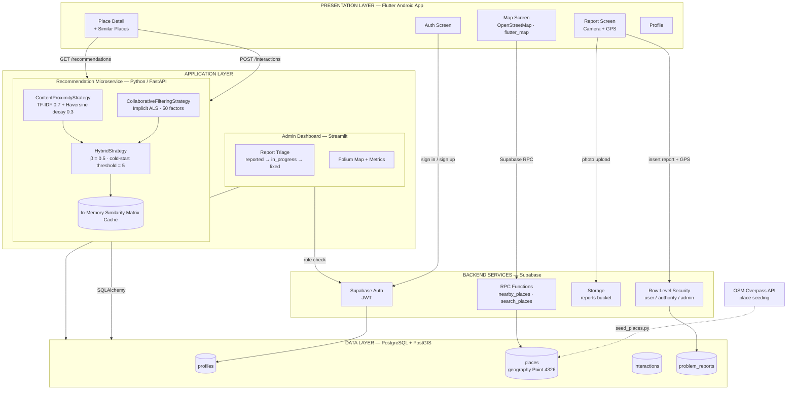

# System Architecture Diagram — Image Generation Prompt

Two assets are provided:

1. **Prompt A** — a full descriptive prompt for an image-generation model
   (Nano Banana / Gemini Image, GPT Image, Midjourney, Ideogram, Firefly).
2. **Prompt B** — a short, style-only variant for models that lose coherence on long prompts.
3. **Fallback** — a Mermaid source that renders a pixel-accurate diagram with perfect text.

> **Practical note:** diffusion image models routinely misspell text inside boxes. For a
> capstone report, generate the image for visual appeal but verify every label, or use the
> Mermaid fallback (renders directly on GitHub, or export as SVG from mermaid.live) when
> label accuracy matters more than styling. Ideogram and GPT Image handle in-image text best.

---

## Prompt A — Full Prompt

```
A clean, professional software system architecture diagram for a mobile application
called "CityGuide", drawn as a flat vector infographic on a white background,
horizontal 16:9 layout, arranged in four clearly separated horizontal layers with
rounded-rectangle boxes, thin grey borders, soft drop shadows, and labelled arrows.
Modern technical documentation style, muted professional palette of teal, indigo,
amber and slate grey, clean sans-serif labels, generous white space, no photorealism,
no 3D, no clutter.

LAYER 1 - TOP - "PRESENTATION LAYER (Flutter Android App)" - a wide teal-tinted band
containing five small rounded boxes in a row, each with a simple line icon:
"Auth Screen" (lock icon), "Map Screen - OpenStreetMap" (map pin icon),
"Place Detail + Similar Places" (list icon), "Report Screen - Camera + GPS"
(camera icon), "Profile" (user icon).

LAYER 2 - UPPER MIDDLE - two separate boxes side by side, connected downward:
On the LEFT, an indigo-tinted box labelled "RECOMMENDATION MICROSERVICE (Python
FastAPI)" containing three stacked inner boxes:
  - "Content + Proximity Strategy - TF-IDF + Haversine"
  - "Collaborative Filtering - Implicit ALS"
  - "Hybrid Strategy - Blend + Cold-Start Fallback"
and beneath them a small amber box labelled "In-Memory Similarity Matrix Cache".
On the RIGHT, an amber-tinted box labelled "ADMIN DASHBOARD (Streamlit)" containing
two inner boxes: "Report Triage + Status Update" and "Folium Map + Analytics".

LAYER 3 - LOWER MIDDLE - a wide slate-grey band labelled "BACKEND SERVICES (Supabase)"
containing four boxes in a row: "Supabase Auth (JWT)", "Row Level Security Policies",
"Supabase Storage - reports bucket", "RPC Functions - nearby_places, search_places".

LAYER 4 - BOTTOM - a dark navy band labelled "DATA LAYER - PostgreSQL + PostGIS"
containing four cylinder database-table shapes labelled: "profiles", "places
(geography Point 4326)", "interactions", "problem_reports". Below this band, a small
detached box on the left labelled "OSM Overpass API - Place Seeding" with a dashed
arrow pointing up into the "places" table.

ARROWS AND LABELS:
- From "Place Detail" down to the Recommendation Microservice, two labelled arrows:
  "POST /interactions" and "GET /recommendations".
- From "Map Screen" down past the microservice, straight to the Backend Services layer,
  labelled "Supabase RPC - nearby_places".
- From "Report Screen" down to Supabase Storage, labelled "Photo Upload + GPS Insert".
- From the Recommendation Microservice down to the Data Layer, labelled "SQLAlchemy".
- From the Admin Dashboard down to the Data Layer, labelled "psycopg2 - Read + Update Status".
- A small legend box in the bottom-right corner with three coloured dots labelled
  "REST/HTTP", "SQL", "Auth".

Everything must be legible, evenly aligned, symmetrical, and centred.
```

---

## Prompt B — Short Variant

```
Flat vector software architecture diagram, white background, 16:9, four stacked
horizontal layers with rounded boxes and labelled arrows, teal/indigo/amber/slate
palette, clean sans-serif text, technical documentation style.
Layer 1 "Flutter Mobile App": Auth, Map (OpenStreetMap), Place Detail, Report (Camera+GPS).
Layer 2: left box "FastAPI Recommendation Service" containing "TF-IDF + Haversine",
"Collaborative ALS", "Hybrid + Cold-Start Fallback", "Similarity Cache"; right box
"Streamlit Admin Dashboard" containing "Report Triage" and "Folium Map".
Layer 3 "Supabase": Auth (JWT), Row Level Security, Storage, RPC Functions.
Layer 4 "PostgreSQL + PostGIS": tables profiles, places, interactions, problem_reports.
Arrows labelled "POST /interactions", "GET /recommendations", "Supabase RPC",
"Photo Upload", "SQLAlchemy", "psycopg2". Minimal, symmetrical, no 3D, no photorealism.
```

---

## Fallback — Mermaid Source (exact labels, GitHub-renderable)


